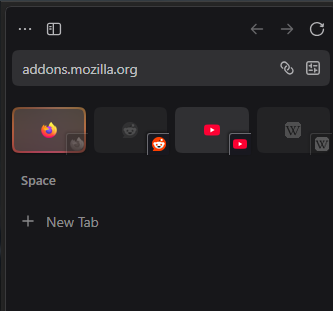
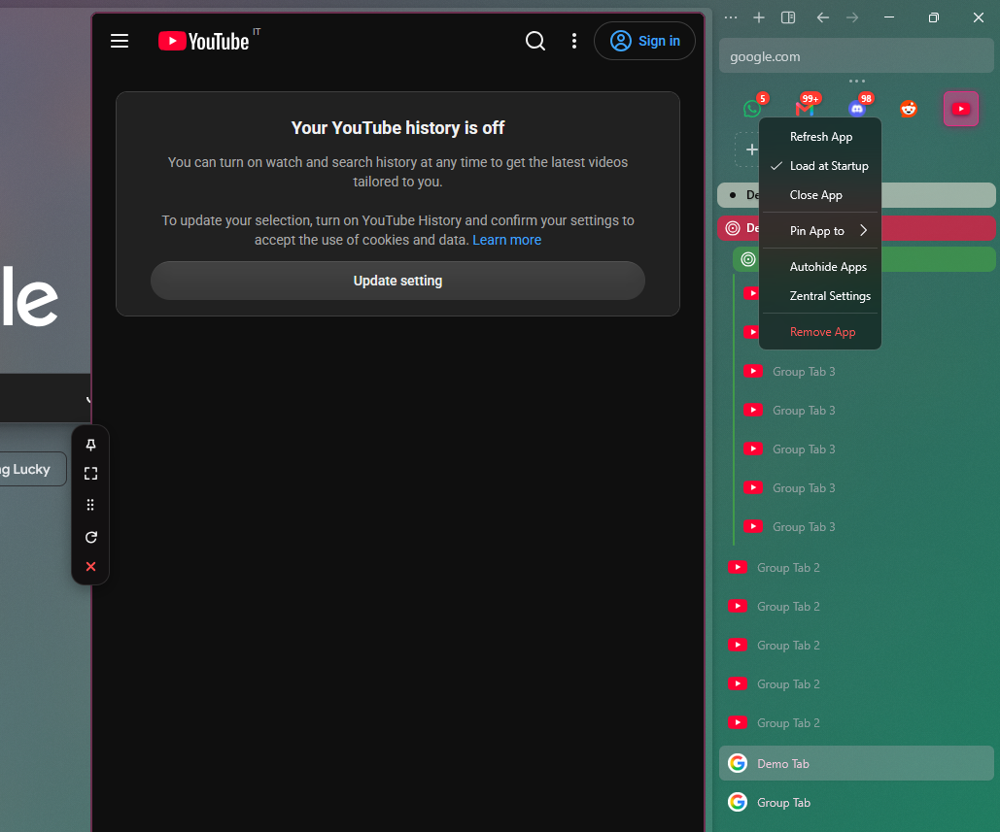
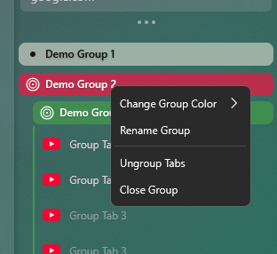
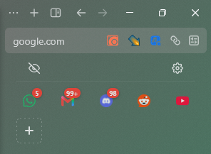
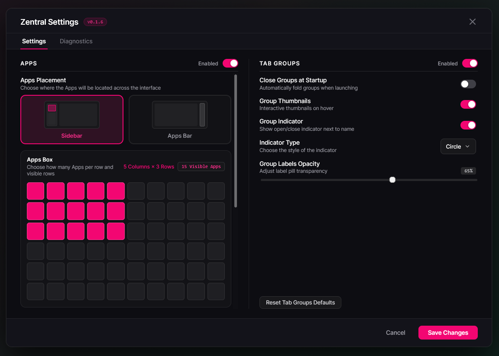

<p align="center">
  <b>This is my personal AI slop extended version of Zentral if you dont need any of those tweaks its better that you will use Michele501st/Zentral-Sine </b>
  <br>
</p>

<p align="center">
  
</p>

---

### Extra Features:

- **Dynamic Translucency:** sometimes a bit of transparency is nice, you can now control how much transparency your panel will have in normal pinned and pinned unfocused state.
- **Opposite-Side Docking:** i wanted to have buttons for panels on normal sidebar, but in compact mode panel moved a bit too much, i decided having it on opposite side would be nice .
- **Corner-Docked Tiles:** by default they taking bit space and if you are used to essentials, they not that intuitive (change order of your panels first i recommend making them match your essencials, then enable this option).
  **^Also now open any tab as panel clicking on favicon^** toggleable in settings, i guess it will be uncompatyble with that one mod that moves unload button there for normal tabs (just use middle mouse button to unload)
- **Push sites when pinned:** feature that been in Vivaldi for years, similar to split view but a bit worse (much more accessible for panels)
- **Disable whatever elements you dont want from pill menu:** you dont need reload button? pill menu is to cluttered? just hide it
- **Switch UserAgent to Mobile** easy to add feature that is avalible in vivaldi web panels, useless on most sites, it shines on Instagram
- **Basic navigation features for panels** back/forward/url bar, things like that
- **Vertical Resize and change vertical position** making it fully able to change position would require big change in core mod
- **Drag panel and resize in 2D** 3D when??
- **Keybinds adn disableing key press propagation** important if you want to close it with ESC button
- **Firefox Containers and Clear Cache & Cookies of panels** i dont use it, heard people like it
- **Better Addon support** still not all addons will work.

### Extra Bugfix:

-**Right click menu closing panel:** this one annoyed me a bit, now i can state that this extension maybe introduces bugs, but it patches some too,

<p align="center">
  
</p>

---

### Future Roadmap:

- **Whatever i will want for myself:** if you want to add something/ have proposition give Michele501st (they know what they are doing way more then me) details, if the proposition seems more like something for this extension then main mod, i will be glad to see what i can do

- **Other mods i do use and they propably never be an issue with it:**
  - Arc 2.0
  - Better CtrlTab
  - Customize Font Size
  - Transparent Zen
  - Zen Folder Tree Connectors

---

## ⚖️ Attribution, Upstream Credits & Disclaimer

- **Original Creator & Project:** This project is an independent fork and extension of **[Zentral](https://github.com/zen-browser)** for Zen Browser, originally developed under the **CC BY-NC-SA 4.0** license. All original code, branding, and core architecture belong to the original author.
- **Modifications:** This repository introduces experimental modifications (the _Bgalazka Extension_ layer) including opposite-side docking overrides, corner-docked essential tab tiles, and custom translucency profiles.
- **Support the Original Dev:** If you enjoy Zentral, please support the original author via their Ko-fi / upstream channels linked in the settings menu.
- **Bug Reports:** **Do not open issues on the upstream Zentral repository for problems encountered while using this fork.** Please file all issues, bugs, and feature requests directly in this repository's Issues tab.
- **License:** Licensed under [Creative Commons Attribution-NonCommercial-ShareAlike 4.0 International (CC BY-NC-SA 4.0)](https://creativecommons.org/licenses/by-nc-sa/4.0/).

<p align="center">
  
</p>

<h1 align="center">Zentral</h1>

<p align="center">
  <b>Unified Web Apps Grid, Floating Side Panels & Enhanced Tab Groups for Zen Browser</b>
  <br>
</p>

<p align="center">
  <a href="theme.json"></a>
  <a href="https://zen-browser.app/"></a>
  <a href="theme.json"></a>
  <a href="https://ko-fi.com/michele501st"></a>
  <a href="LICENSE"></a>
</p>

---

## 📖 Overview

**Zentral** unifies your favorite communication tools, web applications, and tabs into a cohesive, fluidly animated sidebar experience.

<p align="center">
  
</p>
Designed natively for the **Sine Mod Engine**, Zentral features hot-reloading support (`supportsUnload: true`), declarative settings UI, session persistence, automatic high-contrast color calculations, and lightweight Gecko performance with zero external dependencies.

---

## ✨ Key Features & Deep Dive

<details>
<summary><b>🗂️ 1. Tab Groups & Organization</b></summary>
<br>

Zentral significantly expands Zen Browser's native tab group capabilities with styling, smooth interactions, and rich color customization:

<p align="center">
  
</p>

- **🎨 Multi-Mode Color Picker Panel**:
  - **Quick Swatches**: 25 color presets.
  - **2D Spectrum Canvas**: Interactive Saturation-Value box with a 360° Hue slider.
  - **System Eyedropper Tool**: Direct screen color sampler (via native `EyeDropper` API).
  - **Direct Hex & RGB Inputs**: Live dual-way input fields.
  - **Auto Average Favicon Color**: Automatically extracts the average color from group tab favicons in a click.
- **🏷️ Collapsed Sidebar Marquee Carousel**:
  - In Collapsed Sidebar mode, resting state displays clean, non-truncated initials or title text.
  - On hover, starts a looping horizontal scrolling marquee for long names.
- **🔘 Open/Close Indicators**:
  - Toggle and customize group indicators between **Circle Dots** (inspired by Zen logo) and **Chevron Arrows**.
- **🌳 Deep Hierarchy & Nesting**:
  - Full support for multi-level nested tab groups with proper indentation and drag-and-drop support.
  - Native Zen Split Views inside groups drag as unified items.
- **🛡️ Tab Selection & Drag Guard**:
  - Drag and Drop for dormant tabs without waking them up during reordering.
- **📁 One-Click Zen Folder Conversion**:
  - Right-click any folder in your sidebar to convert it to a Tab Group.
- **💾 Full State Persistence**:
  - Persists custom colors, group labels, collapsed states, and nesting structures across browser reboots and workspace switches via Firefox SessionStore.

</details>

<br>

<details>
<summary><b>📱 2. App Box and App Bar & Multi-Instance Web Panels</b></summary>
<br>

Keep your essential web apps (Discord, WhatsApp, Reddit, Spotify, Notion, YouTube, etc.) one click away without cluttering your tab strip:

<p align="center">
  
</p>

- **📍 Flexible Placement Modes**:
  - **Sidebar**: Embeds directly into Zen's sidebar with customizable grid in Zetral Settings.
  - **Vertical Edge Bar**: Standalone vertical dock positioned on the opposite screen edge from Zen's sidebar (left or right).
  - **Top Toolbar**: Compact top bar layout specific for the Collapsed Sidebar layout mode.
- **👻 Intelligent Autohide**:
  - Automatically collapses the floating App Bar or App Box when not in use; expands with smooth hover transitions when approaching the trigger edge.
- **🖼️ Native Zen Theme & Grain Integration**:
  - App Bar matches Zen Browser's active theme gradient and film grain texture with rounded panel borders.
- **🎛️ Full Panel Controls**:
  - **Pin / Unpin**: Keep panels persistently open side-by-side with main web content.
  - **Dynamic Drag Resizing**: Smooth draggable edge resize handle with per-app width memory.
  - **Expand to Full Width**: Maximize panels instantly.
  - **Refresh App**: Reloads the App when necessary.
  - **Close App**: Unloads App to free resources.
- **🌐 Workspace Isolation**:
  - Right-click any app button to choose to which Space pin the App.
- **🔔 Live Unread Notification Badges**:
  - Automatically parses unread message counts from page titles and renders clean overlay badges.
- **⚡ Staggered Background Preloading**:
  - Silently preloads active apps in the background for instant, zero-latency panel popups.
- **🌀 Panel Animation**:
  - Choose between **Smooth Slide**, **Gentle Spring**, **Bouncy Spring**, or **Elastic** transitions.

</details>

<br>

<details>
<summary><b>⚙️ 3. Sine Preferences & Customization Options</b></summary>
<br>
<p align="center">
  
</p>

All preferences are declaratively registered via [`preferences.json`](preferences.json) and customizable live inside **Zen Settings -> Mods -> Zentral**:

| Setting Property                             | UI Label                          | Type       | Default         | Description                                                               |
| -------------------------------------------- | --------------------------------- | ---------- | --------------- | ------------------------------------------------------------------------- |
| `zen.workspace.apps.sidebar.enabled`         | Enable Apps Sidebar Grid & Panels | `checkbox` | `true`          | Master switch for the Apps Grid module                                    |
| `zen.workspace.apps.sidebar.apps_per_row`    | Apps Displayed Per Row            | `dropdown` | `7`             | Number of columns in grid mode (3–10)                                     |
| `zen.workspace.apps.sidebar.max_rows`        | Maximum Grid Rows                 | `dropdown` | `3`             | Maximum visible grid rows before scrolling (1–5)                          |
| `zen.workspace.apps.sidebar.animation_type`  | Panel Animation Easing Curve      | `dropdown` | `spring-gentle` | Panel easing curve (`slide`, `spring-gentle`, `spring-bouncy`, `elastic`) |
| `zen.workspace.tabgroups.enabled`            | Enable Enhanced Tab Groups        | `checkbox` | `true`          | Master switch for enhanced tab group logic                                |
| `zen.workspace.tabgroups.collapse_on_launch` | Collapse Tab Groups on Startup    | `checkbox` | `false`         | Automatically collapse all groups on launch                               |
| `zen.workspace.tabgroups.show_chevron`       | Show Open/Close Indicator         | `checkbox` | `true`          | Display open/close pill indicator                                         |
| `zen.workspace.tabgroups.indicator_type`     | Tab Group Indicator Style         | `dropdown` | `circle`        | Indicator appearance: `circle` (Dot) or `chevron` (Arrow)                 |
| `zen.workspace.tabgroups.thumbnails`         | Show Tab Thumbnails on Hover      | `checkbox` | `true`          | Render live preview thumbnails on tab hover                               |
| `zen.workspace.zentral.debug`                | Enable Diagnostic Logging         | `checkbox` | `false`         | Enables real-time console tracing buffer                                  |

</details>

<br>

<details>
<summary><b>🩺 4. Built-in Diagnostics & Issue Reporter</b></summary>
<br>

Zentral includes a telemetry and diagnostics subsystem:

- **Hotkey Export (`Alt+L`)**: Press <kbd>Alt</kbd> + <kbd>L</kbd> anywhere in Zen to instantly generate and download a clean, structured diagnostic log.
- **Granular Module Tracing**: Independent toggles for Core engine, Tab Groups, Apps Bar, Context Menus, and Computed CSS layout logs.

</details>

---

## ⚡ Installation

### Method 1: Instant Install via Sine Mod Engine (Recommended)

1. In Zen Browser, navigate to **Settings** (<kbd>Ctrl</kbd> + <kbd>,</kbd>) → **Sine Mods**.
2. Paste the repository URL:
   ```text
   https://github.com/Michele501st/Zentral-Sine
   ```
3. Click the **Install** button.
4. Sine will automatically download, validate, and activate Zentral instantly!

---

<div align="center">

### ☕ Support the Project

</div>

<h5>If you enjoy using Zentral and would like to support its ongoing development, optimization, and new features, consider buying me a coffee! Every bit of support is deeply appreciated and helps keep the project active and independent.</h5>

<p align="center">
  <a href="https://ko-fi.com/michele501st" target="_blank">
    
  </a>
</p>

---

### Method 2: Manual Profile Installation

1. Locate your Zen Browser profile directory (`about:support` → **Profile Folder** → _Open Folder_).
2. Inside the profile, create or navigate to `chrome/sine-mods/`.
3. Clone or extract this repository into a folder named `zentral`:
   ```bash
   git clone https://github.com/Michele501st/Zentral-Sine.git "<profile-directory>/chrome/sine-mods/zentral"
   ```
4. Open Zen Browser and enable **Zentral** in your Sine Mod manager.

---

## ⌨️ Shortcuts & Hotkeys

| Shortcut                                  | Action                                                           | Scope                    |
| ----------------------------------------- | ---------------------------------------------------------------- | ------------------------ |
| <kbd>Alt</kbd> + <kbd>L</kbd>             | Export Zentral Diagnostic Log & Snapshot                         | Global Browser Window    |
| <kbd>Click</kbd> on Group Label           | Toggle Expand / Collapse Group                                   | Tab Strip / Sidebar      |
| <kbd>Right Click</kbd> on Group Label     | Open Zentral Custom Context Menu (Rename, Color Picker, Ungroup) | Tab Strip / Sidebar      |
| <kbd>Right Click</kbd> on App Tile        | Configure App Settings, Icon, Mobile Mode & Workspace Visibility | Apps Grid / Vertical Bar |
| <kbd>Right Click</kbd> on Bookmark Folder | Convert Folder to Tab Group                                      | Zen Sidebar              |

---

## 📂 Repository Structure

```text
Zentral-Sine/
├── theme.json            # Sine Mod manifest (ID, metadata, unload capability)-Changed to extended version manifest
├── preferences.json      # Declarative schema for native Zen settings UI
├── chrome.css            # Stylesheet overrides (glassmorphism, layout, animations)-extension CSS is added on bottom of this file
├── JS/
│   ├── Zentral.uc.js     # Master userChromeJS script (Apps, TabGroups, ColorPicker)-extension JS is added on bottom of this file
├── JS/
│   └── zentral_logger.uc.js # High-performance diagnostic logging engine
├── assets/
│   ├── Zentral Logo.png  # High-resolution raster logo
│   └── Zentral Logo.svg  # Vector branding asset
└── serverless/           # Issue reporter worker endpoint definition
```

---

## 📄 License

Distributed under the **Creative Commons Attribution-NonCommercial-ShareAlike 4.0 International License (CC BY-NC-SA 4.0)**.

- **Attribution**: You must give appropriate credit to the author ([Michele Pierini](https://github.com/Michele501st)).
- **NonCommercial**: You may not use the material for commercial purposes or bundling for sale.
- **ShareAlike**: If you remix, transform, or build upon the material, you must distribute your contributions under the exact same license.

See the [LICENSE](LICENSE) file for complete details.
